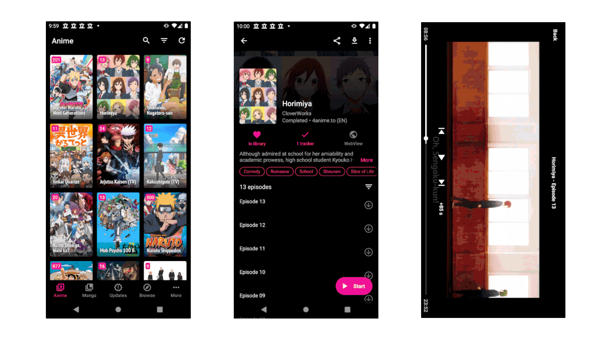

| Build | Preview Release | Codefactor | Stable Release | Translate Tachiyomi | Discord Server |
|-------|-----------|-------|----------|------------|---------|
|  |  |  |  |  |  |

# Aniyomi
Aniyomi is an unofficial fork of the free and open source manga reader [Tachiyomi](https://github.com/tachiyomiorg/tachiyomi) that adds anime capabilities! For Android 6.0 and above.

## Features

Features include:
* Watching anime from [a variety of sources](https://github.com/jmir1/tachiyomi-extensions)
* Everything you know and love about Tachiyomi: 
    * Online reading from [a variety of sources](https://github.com/tachiyomiorg/tachiyomi-extensions)
    * Local reading of downloaded manga
    * A configurable reader with multiple viewers, reading directions and other settings.
    * [MyAnimeList](https://myanimelist.net/), [AniList](https://anilist.co/), [Kitsu](https://kitsu.io/), [Shikimori](https://shikimori.one), and [Bangumi](https://bgm.tv/) support
    * Categories to organize your library
    * Light and dark themes
    * Schedule updating your library for new chapters
    * Create backups locally to read offline or to your desired cloud service

## Download
Get the app from the [releases page](https://github.com/jmir1/tachiyomi-mi/releases).

## Issues, Feature Requests and Contributing

Feel free to open an issue if anything is on your mind or if you have a question, request, suggestion, bug report etc!! 

## License

    Copyright 2015 Javier Tomás

    Licensed under the Apache License, Version 2.0 (the "License");
    you may not use this file except in compliance with the License.
    You may obtain a copy of the License at

    http://www.apache.org/licenses/LICENSE-2.0

    Unless required by applicable law or agreed to in writing, software
    distributed under the License is distributed on an "AS IS" BASIS,
    WITHOUT WARRANTIES OR CONDITIONS OF ANY KIND, either express or implied.
    See the License for the specific language governing permissions and
    limitations under the License.

## Disclaimer

The developer of this application does not have any affiliation with the content providers available.
